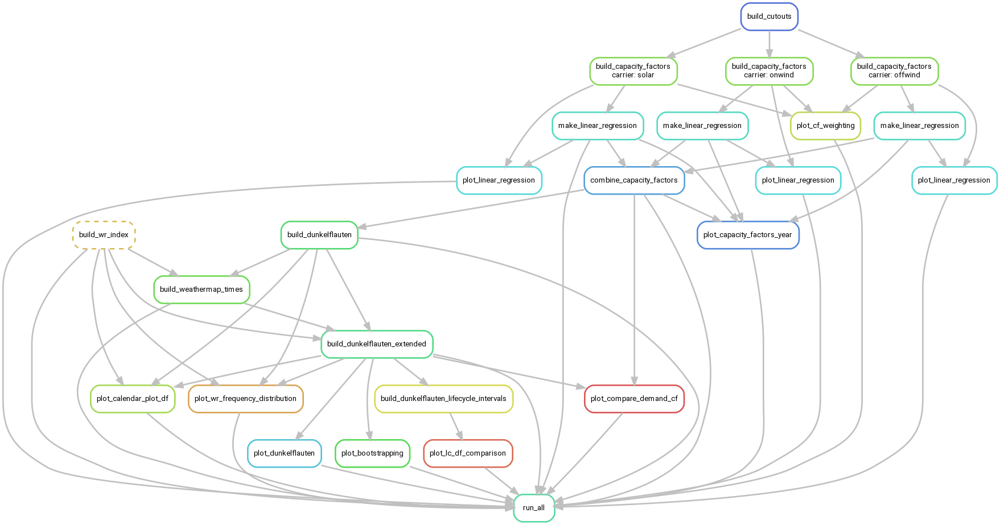

## Introduction

This repository provides python codes for the paper:

> Mockert, F., Grams, C. M., Brown, T., Neumann, F., 2023. Meteorological conditions during periods of low wind speed and insolation in Germany: the role of weather regimes. *arXiv preprint https://arxiv.org/abs/2212.04870*

## Data
The ERA5 data can be obtained from the Climate Data Store \url{https://cds.climate.copernicus.eu/#!/home}. 
The historical power output and installed capacity can be retrieved from \url{https://data.open-power-system-data.org/time_series/2019-06-05}. 
The demand data is available at \url{https://doi.org/10.17864/1947.273}.
Weather regime data is available within this github repository.

## Installation

Install [`conda`](https://docs.conda.io/en/latest/miniconda.html) and then install the `conda` environment required for this workflow

```bash
conda env create -f environment.yaml
```

Then before running the workflow activate the environment:

```bash
conda activate dunkelflauten
```

For running the rule `build_cutout` yourself it is necessary to follow the [instructions for setting up the CDS API](https://cds.climate.copernicus.eu/api-how-to).

## Structure and Usage

The individual scripts are tied together by a [`snakemake` workflow](https://snakemake.readthedocs.io/en/stable/) as defined by their individual input and output files.

From the [Snakemake Documentation](https://snakemake.readthedocs.io/en/stable/):

> The Snakemake workflow management system is a tool to create reproducible and scalable data analyses. Workflows are described via a human readable, Python based language.

From the [PyPSA-Eur Documentation](https://pypsa-eur.readthedocs.io/en/latest/introduction.html):

> [T]he `Snakefile` declares for each python script in the scripts directory a rule which describes which files the scripts consume and produce (their corresponding input and output files). The snakemake tool then runs the scripts in the correct order according to the rules’ input/output dependencies. Moreover, it is able to track, what parts of the workflow have to be regenerated, when a data file or a script is modified/updated.

Hence, what files are generated or required by which script can be easily looked up in the rule definitions in the `Snakefile`.

For instance an invocation to

```
snakemake run_all --cores all
```

follows this dependency graph:



The dependency graph was generated with:

```
snakemake --dag run_all | dot -Tpng > workflow.png
```

## Configuration

The workflow can be configured in `config.yaml`.

The setting `build_cutouts:` specifies whether to activate the `build_cutout` rule or provide the cutouts manually in `./data/cutouts`.

The setting `years:` specifies the range of years to include in the analysis.

The section `scenarios:` specifies lists of [wildcards](https://snakemake.readthedocs.io/en/stable/snakefiles/rules.html#wildcards) to run through:

- `country`: using a two-letter country code, fixed to Germany (DE)
- `duration`: minimum duration in hours of low feed-in to qualify as a lull period, fixed to 48h
- `level`: capacity factor threshold below which a period may be part of a dark lull period, fixed to 0.06
- `source`: source of weather data, fixed to atlite
- `exponent`: exponent applied to average capacity factors per weather grid cell; used to aggregate capacity factors to country, fixed to 1
- `method`: method used to determine shortfall periods, fixed to rolling_average
- `corr`: switch to activate regression correction based on OPSD actual generation data, fixed to corrected

For the section `cutout:`, refer to the [Atlite documentation](https://atlite.readthedocs.io/en/latest/examples/create_cutout.html).

For the section `technology:`, refer to the [PyPSA-Eur documentation](https://pypsa-eur.readthedocs.io/en/latest/configuration.html#renewable). Currently, possible technologies are `onwind` and `solar`

The section `plotting:` sets [plotting style](https://matplotlib.org/3.1.1/gallery/style_sheets/style_sheets_reference.html) and specifies colors for the generation technologies (`tech_colors:`) and weather regimes (`regime_colors:`).
